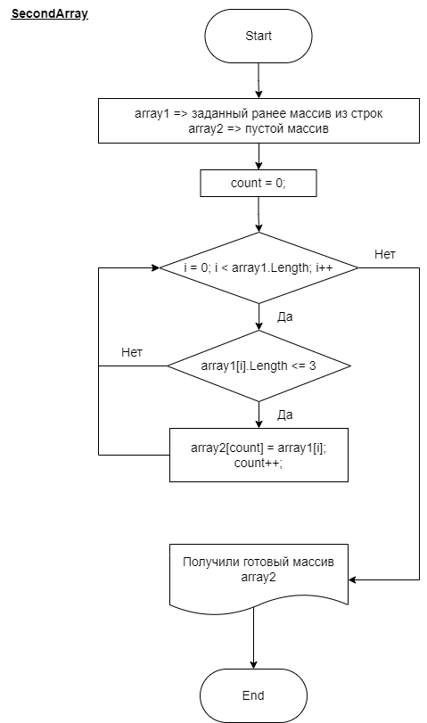

# README

## Оформленное текстовое описание решения

### **Полезное:**

* [Ссылка на задание](https://gb.ru/lessons/326759/homework)
* [Ссылка на репозиторий](https://github.com/shenlindao/control-work)
* [Ссылка на диаграму](control-work.drawio)
* [Ссылка на программу](Program\Program.cs)
* [Ссылка на библиотеку](Program\Library.cs)

### **Описание работы программы**

* При запуске программы польователю будет предложено задать количество строк, которое он планирует ввести, таким образом определяется размерность массива array1.
* Затем пользователь вводит поочередно строки, заполняя массив array1.
* Далее происходит основной алгоритм, при котором из массива array1 создается массив array2, посредством выборки строк по заданному правилу (в данном случае, чтобы размерность строки не привышало 3 символа).
* По итогу, сформированный ранее массив array2 выводится на экран.

### **Диаграмма основного алгоритма**

SecondArray

